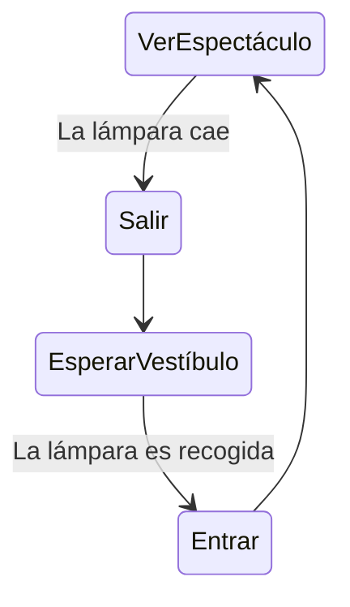
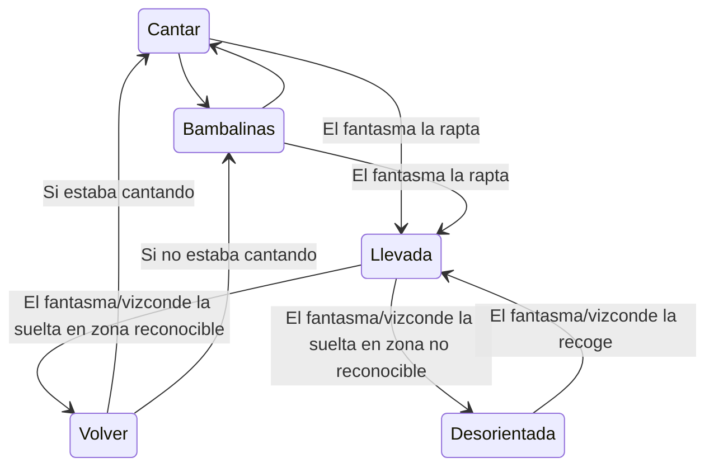
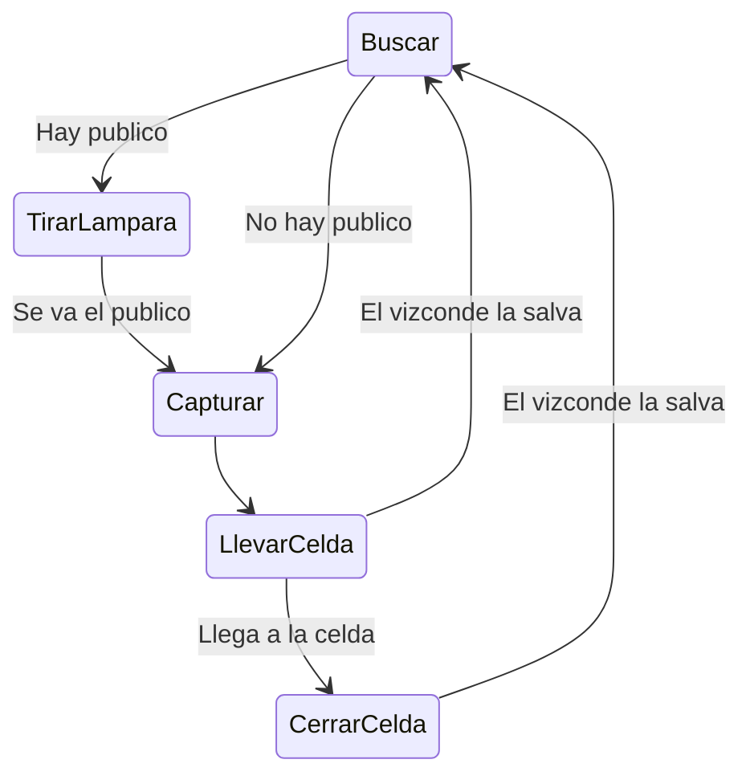

# IAV - Practica 4

## Autores
- Javier Villegas Montelongo ([Yavi123](https://github.com/Yavi123))
- Gonzalo Fernández Moreno ([GonzaloFdezMoreno](https://github.com/GonzaloFdezMoreno))
- Enrique Juan Gamboa ([ivo_hr](https://github.com/ivo-hr))

## Propuesta
Este proyecto es una práctica de la asignatura de Inteligencia Artificial para Videojuegos del Grado en Desarrollo de Videojuegos de la UCM, cuyo enunciado original es este: [Batalla en el Desierto](https://github.com/Narratech/IAV-Coordinacion).

La practica consiste en desarrollar una IA para prototipo de un juego RTS (Real Time Strategy), dentro de un entorno virtual que represente un campo de batalla con dos facciones cuyo objetivo es destruir a la otra. Cada facción puede ser controlada por el jugador o por una IA ya programada.

## Punto de partida
Se parte de un proyecto base de Unity 2021 proporcionado por el profesor y disponible en este repositorio: [IAV-Coordinación](https://github.com/Narratech/IAV-Coordinacion).

En el proyecto podemos ver dos facciones, cada una tiene su base principal, un edificio desde donde aparecen las unidades y dos "cosechadoras" ya creadas.
Las dos facciones son controladas por un GameManager que guarda el estado de la partida y contiene los métodos que deben llamar las IAs de cada facción.
Aparte de un script que permite controlar una facción al jugador, también podemos encontrar entre los assets unos scripts que controlan automáticamente una facción al añadirse estas mismas como controlador.

Cada facción puede crear una de las siguientes unidades, cada una con su coste diferente:
- Cosechadora (10000): Esta unidad se dedica a ir a una zona de recursos y una vez a dejado de recolectar volverá a la base a dejar los recursos y transformarlos en dinero.
- Explorador (15000): Es básicamente un soldado de a pie, con muy poca vida y muy poca capacidad de daño.
- Destructor (30000): Una unidad de ataque mucho mas poderosa que un explorador.

## Diseño de la solución

Lo que vamos a realizar para resolver esta práctica es completar todos los scripts que hay en el proyecto sin completar, como el comportamiento del público para que huya cuand cae la lámpara correspondiente, y vuelva cuando la lámpara se encienda.

También habrá que completar los scripts que utiliza el árbol de comportamiento del fantasma para que tenga el comportamiento pedido

La cantante le queda por implementar los scripts que definen sus comportamientos que estan definidos por una máquina de estados

Público:

Cantante:

Fantasma:

Para dibujar espacios de coordenadas 2D con puntos y vectores, se podría incrustar una imagen de Google Draw, o intentar incrustarlo en el repositorio también con Mermaid. 

## Pruebas y métricas

- [Vídeo con la batería de pruebas](https://youtu.be/7uuU-owzgjM)

## Ampliaciones

Se han realizado las siguientes ampliaciones :trollface:

## Producción

| Estado  |  Tarea  |  Fecha  |  
|:-:|:--|:-:|
| ✔ | Diseño: Primer borrador | 20-04-2023 |
| ✔ | Característica A: Mundo virtual, movimiento e interaccion con entorno | ... |
| :x: | Característica B: Controlador automatico para IA vs jugador e IA vs ella misma| ... |
| :x: | Característica C: visualizar y actualizar mapa de influencia| ... |
| :x: | Característica D: realizacion constante de acciones y decisión de reacción| ... |
| :x: | Característica E: Sistema de gestión inteligente teniendo en cuenta todo el entorno| ... |
|  | OPCIONAL |  |
| :x: | Mapa nuevo | ... |
| :x: | Añadir un tercer peloton | ... |
| :x: | Nuevo tipo de unidad: espia; que recibe informacion extra del enemigo | ... |
| :x: | Mejor gestion sensorial | ... |

## Referencias

Los recursos de terceros utilizados son de uso público.

- *AI for Games*, Ian Millington.
- [Kaykit Medieval Builder Pack](https://kaylousberg.itch.io/kaykit-medieval-builder-pack)
- [Kaykit Dungeon](https://kaylousberg.itch.io/kaykit-dungeon)
- [Kaykit Animations](https://kaylousberg.itch.io/kaykit-animations)
